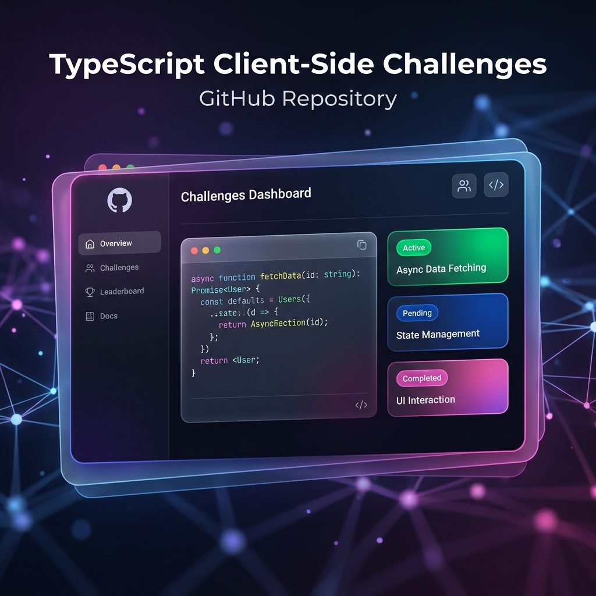

# 🚀 TypeScript Client-Side Challenges



Welcome to the **TypeScript Client-Side Challenges** repository! This collection is a dedicated space for mastering TypeScript in the browser. Each challenge focuses on specific aspects of DOM interaction, asynchronous operations, and modern frontend logic.

---

## 🛠️ Tech Stack

Built with a focus on type safety and performance:


---

## 🎯 Challenges Overview

Dive into individual modules to practice core TypeScript skills:

| Challenge | Topic | Difficulty |
| :--- | :--- | :--- |
| **[Add Items to List](./add-items-to-list)** | DOM Manipulation | ⭐ |
| **[Book Search](./book-search)** | API Fetching & Async | ⭐⭐⭐ |
| **[Change BG Color](./change-background-color)** | Event Handling | ⭐ |
| **[Character Count](./character-count)** | Form Logic | ⭐ |
| **[Delete Items](./delete-items-from-list)** | State Syncing | ⭐⭐ |
| **[Input & Display](./input-and-display)** | Data Binding | ⭐ |
| **[Todo App](./todo-app)** | Full CRUD App | ⭐⭐⭐ |
| **[Toggle Visibility](./toggle-visibility)** | UI Switching | ⭐ |
| **[Update Text](./update-text)** | Basics | ⭐ |

---

## 🚀 Getting Started

To explore these challenges locally, you can use any static file server or the recommended extension:

### Option 1: VS Code Live Server (Recommended)
1.  Open the repository in VS Code.
2.  Install the **Live Server** extension.
3.  Right-click on any `index.html` file and select **"Open with Live Server"**.

### Option 2: Using Bun / NPM
Since each challenge includes a `package.json` for types, you can also use a command-line server:

```bash
# Navigate to a challenge
cd todo-app

# Install types
bun install

# Serve the files (using your preferred server tool)
npx serve .
```

---

## 🏗️ Project structure

The repository is organized by feature-specific folders, making it easy to focus on one implementation at a time.

```text
.
├── [challenge-name]/
│   ├── index.html
│   ├── index.ts
│   └── package.json
├── LICENSE
└── README.md
```

---

## 📜 License

Distributed under the **MIT License**. See `LICENSE` for more information.

